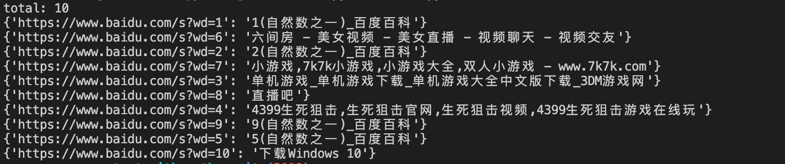

# name
python并发性能测试脚本

# description
用于测试 python 并发功能的一个脚本，以请求 百度 为例子做参考效果如下。

大概的 cProfile 性能测试如下表：
| 类型             | 方法名                 | 性能                                                               |
| ---------------- | ---------------------- | ------------------------------------------------------------------ |
| 多进程           | test_process           | 11515 function calls (11430 primitive calls) in 6.422 seconds      |
| 多进程池         | test_pool_process      | 11515 function calls (11430 primitive calls) in 6.422 seconds      |
| 多线程           | test_thread            | 946 function calls (944 primitive calls) in 6.719 seconds          |
| 协程             | test_coroutine         | 9352746 function calls (9350587 primitive calls) in 44.384 seconds |
| 协程，gevent方式 | test_gevent            | 9347315 function calls (9325329 primitive calls) in 9.279 seconds  |
| 程+协程          | test_coroutine_process | 11531 function calls (11446 primitive calls) in 7.115 seconds      |
| 异步io           | test_asyncio           | 8890847 function calls (8890395 primitive calls) in 8.987 seconds  |
| 多进程+异步io    | test_process_asyncio   | 11461 function calls (11376 primitive calls) in 3.916 seconds      |
| 多线程+异步io    | test_thread_asyncio    | 1579 function calls (1577 primitive calls) in 5.990 seconds        |

数据会受本地机器性能影响，所以只能参考。
# using
修改main.py里面__main__主函数的对应方法。