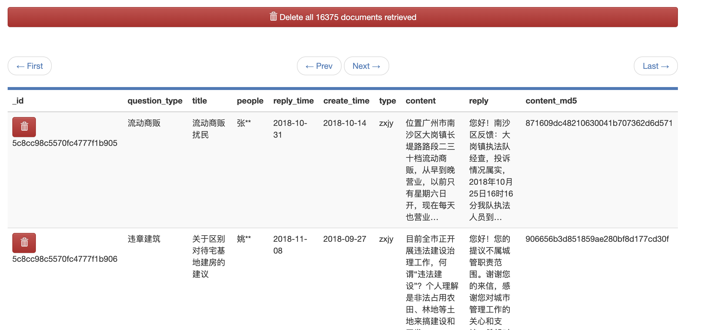

# name
python+mongo-express数据抓取展示

# description
为了查之前的投诉信息，广州政务网站连个搜索框都没有，都2018年了，为了方便个人使用，开发了一个使用代理的并发小爬虫脚本，放在mongo里面方便个人条件搜索。

# using

* main_asyncio.py 是异步方式写的，并不适合服务器较差的网站，瞬间请求并发会把服务器给打垮，我可不想惹麻烦。
* main_process.py 后面用进程池的方式写了一遍，请求中加上了sleep比较合适。
