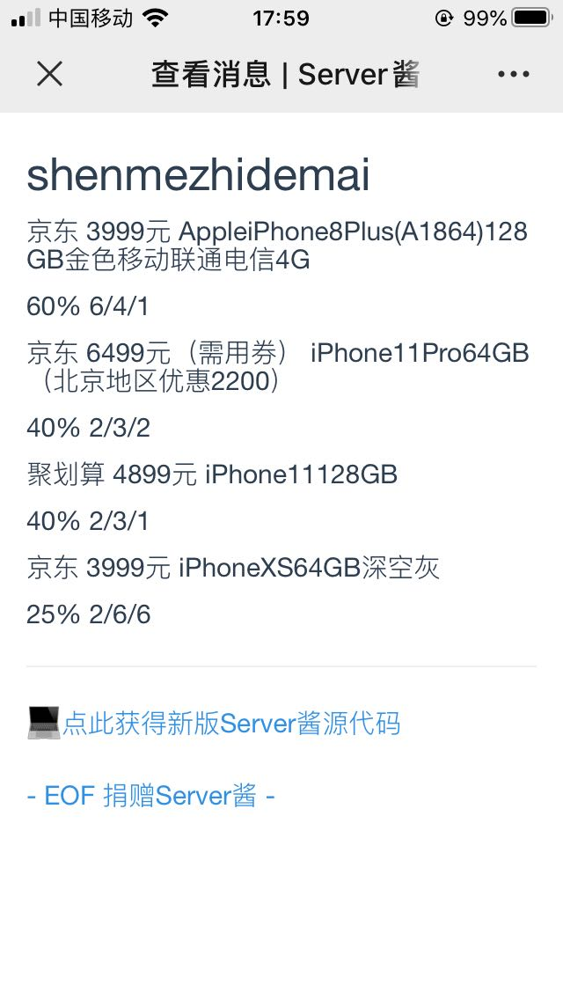

# name
什么值得买价格监控微信推送

# Description
python+sqlite3实现的小功能
大概逻辑是crontab每小时抓取smzdm主页关注的商品信息，入库sqlite3，用于过滤查询，轮训的时候如果发现价格、点值率达到预期，则通过[Server酱](https://sc.ftqq.com/3.version)微信通知自己。

# using
 * 1.修改自己的 search_data
 * 2.替换为自己的push_url
